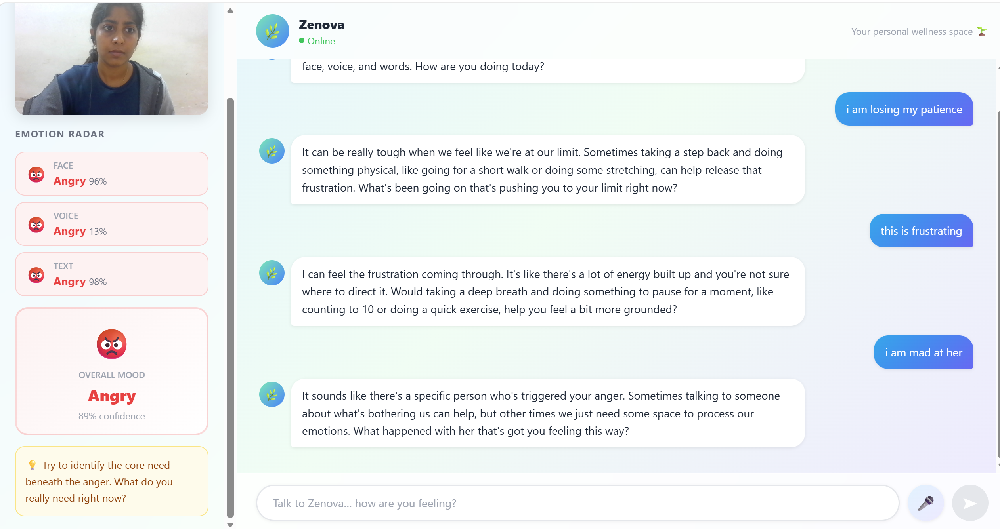
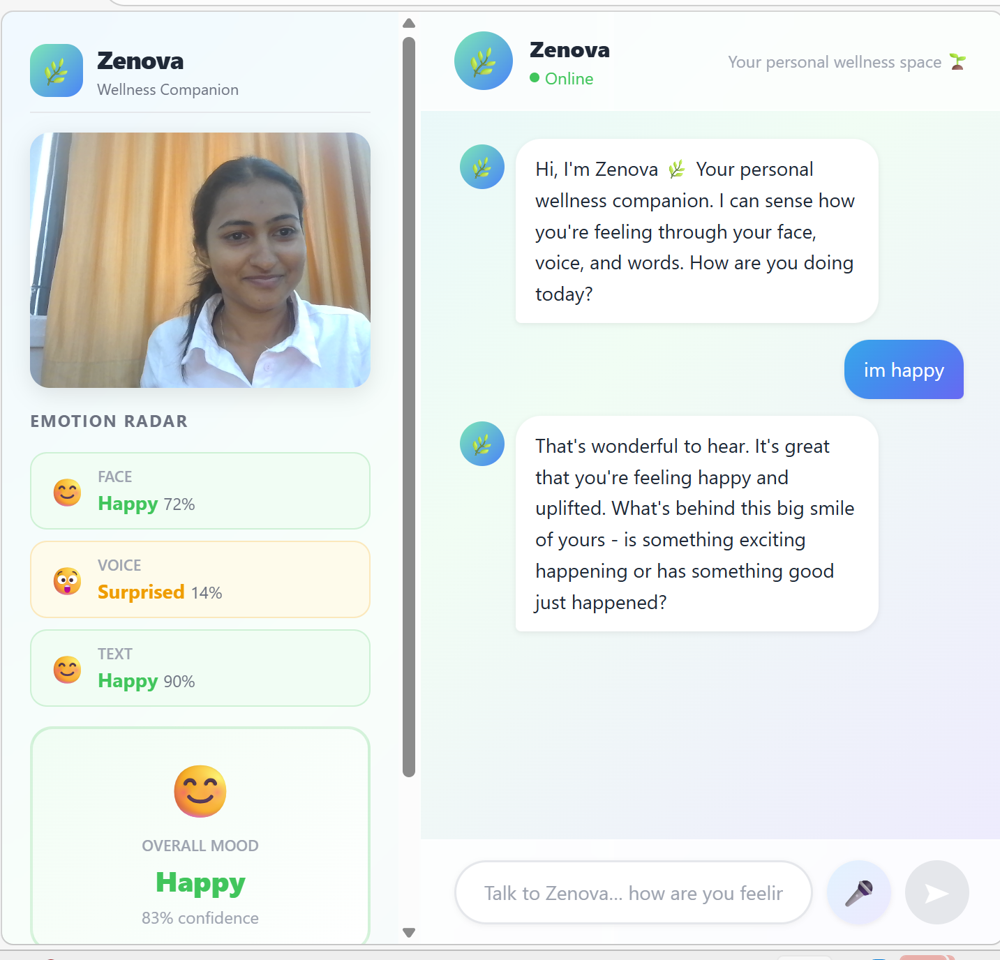

**Zenova – Smart Healthcare Chatbot with Emotion Detection**
 
Zenova is an AI-powered healthcare chatbot designed to provide intelligent, context-aware responses by analyzing user emotions. It combines natural conversation with emotion detection to deliver more personalized and meaningful healthcare suggestions. 
 
Features -  
Interactive chatbot for healthcare queries 
Emotion detection from user input (text/image-based, depending on your implementation) 
Context-aware responses based on detected emotions 
Real-time interaction with responsive UI 
Backend API integration for processing and responses 
 
Tech Stack   
Frontend -  
React.js  
HTML, CSS, Tailwind  
Backend -  
Python  
FastAPI  
Machine Learning  
Emotion detection model  
NLP-based response handling  
 
System Architecture
                    ┌─────────────────────┐
                    │        User         │
                    └──────────┬──────────┘
                               │
               ┌───────────────┼───────────────┐
               │               │               │
               ▼               ▼               ▼
          Text Input      Speech Input     Facial Input
               │               │               │
               ▼               ▼               ▼
         Text Emotion     Speech Emotion   Facial Emotion
            Model            Model            Model
               │               │               │
               └───────────────┼───────────────┘
                               ▼
                       Emotion Fusion
                               │
                               ▼
                    Emotion-Aware Processing
                               │
                               ▼
                       Conversational AI
                               │
                               ▼
                    Personalized Response
                               │
                               ▼
                             User
                              
## Project Screenshots
### Home Screen

### Chatbot Response

##Patent
A patent application has been published for the multimodal
emotion-aware healthcare conversational framework.

**Title:** A System and Method for a Multimodal Emotion-Aware Healthcare Conversational Framework

**Application No.:** 202641102032 A

**Publication Date:** 4 September 2026

[View Patent Publication](patent.pdf)
Backend Setup -  
pip install -r requirements.txt  
python main.py 
Frontend Setup - 
cd frontend 
npm install 
npm start 
 
How It Works -  
1. User interacts with the chatbot via UI 
2. Input is sent to backend API 
3. Emotion detection model analyzes user input 
4. Chatbot generates response based on emotion + query 
5. Response is displayed in real-time 
 
Author  
 
Saniya Dsilva 
